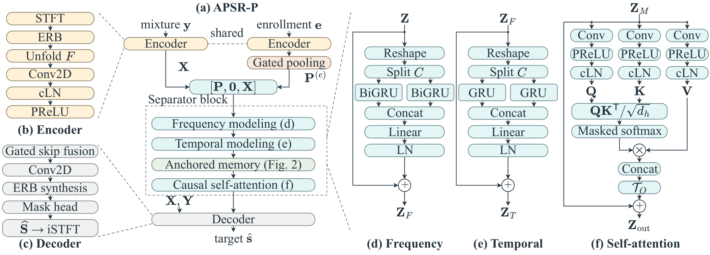

# APSR-P

**Enrollment-Anchored Memory and Progressive Refinement for Causal Target Speaker Extraction**

[Project website](https://Xiang-Lin75.github.io/APSR-P/)

Zi-Xiang Lin, Shao-Chun Hu, Jeih-Weih Hung, and Hung-Shin Lee  
National Chi Nan University; National Taiwan Normal University

## Current release

This is the public research project page. Training/inference code, model weights,
configurations and evaluation instructions are **planned for release after acceptance**.
Audio examples are pending confirmation of the applicable WSJ0 publication terms.
The initial public release contains the website, method diagrams and aggregate results.

## Method

APSR-P uses frequency-resolved enrollment anchors to guide a bounded causal
memory's candidate, update rate and read gate. An enrollment-only stream progresses
across shared refinement blocks while each block call maintains its own acoustic-time
memory. The decoder reconstructs the target through complex masking.

## Verified WSJ0-2mix result

| SI-SDRi (dB) | SDRi (dB) | PESQ | eSTOI (%) | Target-confusion rate (%) |
|---:|---:|---:|---:|---:|
| 13.81 | 14.17 | 3.10 | 87.82 | 1.95 |

Validation-selected P checkpoint E102, seed 43, four refinement rounds;
6,000 target queries from 3,000 mixtures. SI-SDRi/SDRi subtract the corresponding
mixture baseline for each query. TCR is 117/6,000. The model has 306,842 trainable
parameters (312,986 registered); its documented 4-s mixture/3-s enrollment profile
costs 4.923 G MAC/s. Remaining ablations and WHAM! results are pending.

Neural operations are causal in STFT-frame order, with 16-ms centered-STFT analysis
lookahead. Cached streaming and end-to-end real-time performance remain unverified.
The planned listening examples use precomputed outputs.

## Website

For local preview: `python -m http.server 8766 --bind 127.0.0.1 --directory site`.
Then open http://127.0.0.1:8766/.

GitHub Pages deploys `site/` through the included Actions workflow. The comparison
layout is informed by [Universal Speech Enhancement Demo](https://nanless.github.io/universal-speech-enhancement-demo/)
and [LExt](https://zqwang7.github.io/demos/LExt_demo/index.html). Their audio, figures,
results and source code are not copied.

See [release plans](RELEASE_PLAN.md) and [data notice](DATA_NOTICE.md).
`SHA256SUMS` records every file in the reviewed publication package except itself.
