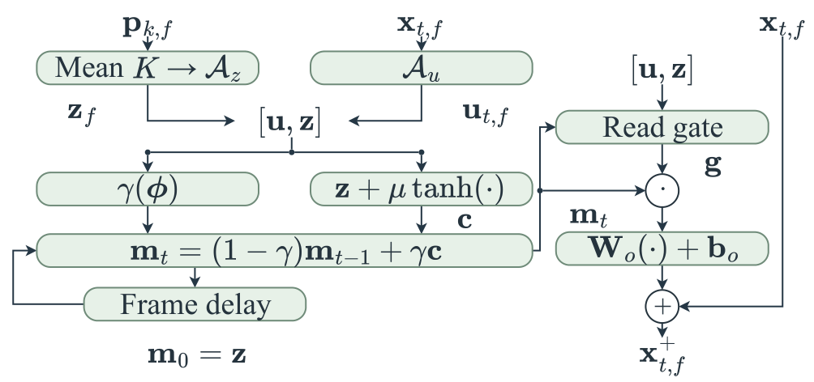

# APSR-P documentation

Start with the [Quick Start](../README.md). The public package contains the paper's main P model; experimental variants are not included.

| Task | Guide |
|---|---|
| Prepare WSJ0-2mix / WHAM! and paired manifests | [Data](DATA.md) |
| Train or resume; understand initialization | [Training](TRAINING.md) |
| Extract audio or use the Python API | [Inference](INFERENCE.md) |
| Evaluate full utterances and interpret metrics | [Evaluation](EVALUATION.md) |
| Read checkpoint selection and frozen test results | [Model card](MODEL_CARD.md), [results](../evaluation/README.md) |
| Download and verify weights | [Checkpoints](../checkpoints/README.md) |
| Map paper components to implementation | [Code map](CODE_MAP.md) |
| Measure MACs and runtime | [Efficiency](EFFICIENCY.md) |
| Inspect source-equivalence evidence and its limits | [Integration verification](SOURCE_INTEGRATION.md) |
| Check permitted use and attribution | [License status](../LICENSE_STATUS.md), [software](THIRD_PARTY_NOTICES.md), [audio](DATA_NOTICE.md) |

## Repository layout

```text
apsr/          Main-model modules, data loading, losses, metrics, trainer
configs/       WSJ0-2mix and WHAM! recipes
protocols/     Frozen training/validation identities
checkpoints/   Weight metadata and untrained seed-43 initialization fixture
scripts/       Checkpoint download and manifest preparation
tests/         Model and protocol regression checks
evaluation/    Frozen E102 test evidence and its verifier
docs/          Guides, architecture figures, and verification records
site/          Published audio demo and its assets
```

`train.py`, `evaluate.py`, and `inference.py` are the main entry points. `benchmark.py` measures MACs and runtime. Training and evaluation dependencies are optional so inference does not require installing every metric package.

## Architecture figures

Overview: [PDF](figures/apsr_overview.pdf) · [editable Draw.io](figures/apsr_overview.drawio).

Memory: [PDF](figures/apsr_memory.pdf) · [editable Draw.io](figures/apsr_memory.drawio).



Each block call fixes its enrollment reference over mixture time and starts a separate causal memory trajectory. Candidate saturation bounds latent displacement; it does not guarantee correct speaker selection. See the [code map](CODE_MAP.md) for the two recurrence axes.
